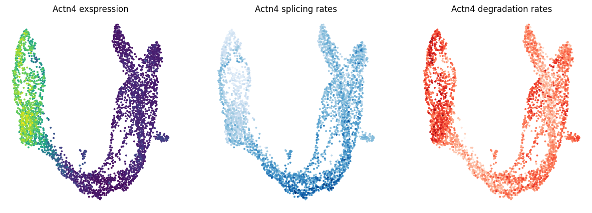
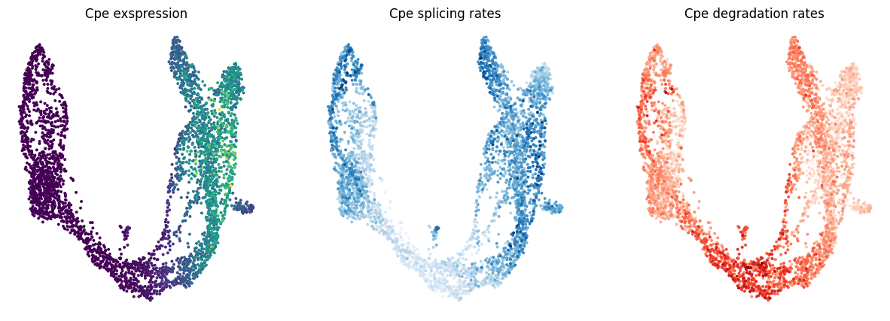

# DeepKINET (A Deep Generative Model with Single Cell RNA Kinetics)
DeepKINET is a deep generative model to estimate mRNA kinetic rates at the single-cell level.

[Teppei Shimamura's lab](https://www.shimamlab.info/), Tokyo Medical and Dental university at Tokyo and Nagoya University at Nagoya

[Yasuhiro Kojima's lab](https://www.ncc.go.jp/jp/ri/division/computational_life_science),   National Cancer Center Research Institute at Tokyo

Developed by Chikara Mizukoshi

# Instalation
You can install DeepKINET using following command.
```
pip install deepkinet
```
Or you can use the latest development version from GitHub.
```
git clone https://github.com/3254c/DeepKINET
```

# Usage
Estimation of splicing and degradation rates at the single cell level, gene clustering using these rates, and obtaining a list of genes with significant rate variation among cell populations can be performed in the [IPython Notebook](tutorial/DeepKINET_tutorial.ipynb) included in tutolial.

## Estimate cellular kinetics
You need to prepare anndata, including count data for unspliced and spliced transcripts.
When filtering genes or cells, any transformations such as normalization or log transformations must be converted back to raw count data before use.
```
adata = scv.datasets.pancreas()
scv.pp.filter_and_normalize(adata, min_shared_counts=20, n_top_genes=2000)
raw_adata = scv.datasets.pancreas()
adata.layers['spliced'] = raw_adata[:, adata.var_names].layers['spliced']
adata.layers['unspliced'] = raw_adata[:, adata.var_names].layers['unspliced']
```
The following code is used to estimate cell state kinetics and cell state dynamics.
```
adata, deepkinet_exp = deepkinet.estimate_kinetics(adata)
```
## Visualization kinetic rates
For all genes used for input, splicing and degradation rates at the single cell level can be obtained.
```
gene_a = 'Actn4'
deepkinet.visualization_kinetics(adata, gene_a)
gene_b = 'Cpe'
deepkinet.visualization_kinetics(adata, gene_b)
```



